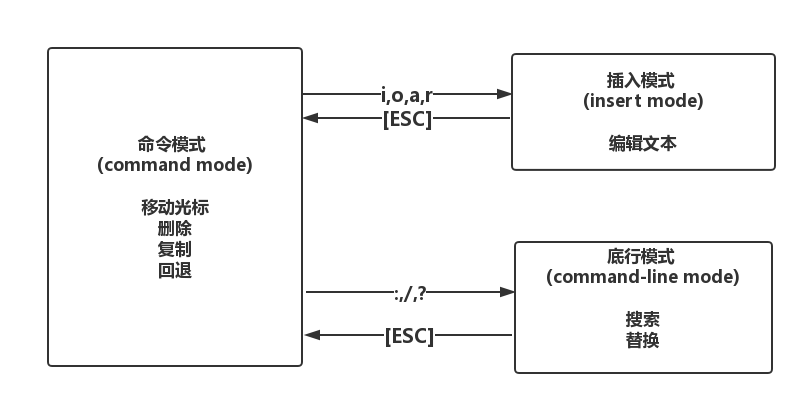

```
PS:本文内容来自《鸟哥的linux私房菜-基础篇》第四版 第九章
```

## vim
### 三种模式

####  命令模式 (command mode)
- 用vim打开文件默认进入命令模式

##### 可进行的操作

- 移动光标(`hjkl`或者`↑↓←→`)
- 删除字符(`x`) 删除单词(`d+w`) 删除整行(`d+d`) 删除光标位置至行末(`D`) 删除当前行至文章末(`d+G`)
- 复制一行(`yy`) 粘贴(`p`)
- 回退(`u`)

####   插入模式 (insert mode)
- 在命令模式下进入插入模式(`i ，I，r, R, o, O, a, A`)

####  底行模式 (command-line mode)

- 在命令模式下进入底行模式(`：，/，？`)

##### 可进行的操作

- 搜索
- 替换
- 设置取消行号 (`set nu/set nonu`)
- 保存退出

#### 三种模式切换



##### 命令模式进入插入模式
- `i/I` i为从光标处插入，I为从光标所在行的第一个非空字符处插入
- `a/A` a为从光标处下一个字符处插入,A为从光标所在行的最后一个字符串处开始插入
- `o/O` o为在光标所在行下插入一行，O为在光标所在行上一行插入一行
- `r/R` 进入replace模式，r只会取代光标所在处的字符一次，R会一直取代光标所在处的文字，直到按下Esc为止

##### 底行模式下的存储和离开
- `:wq` 保存退出  `:wq!` 强制保存退出
- `:w` [filename] 另存为filename文件
- `:q` 退出  `:q!`强制退出
- `ZZ` 若文件有改动则存储之后离开，未改动直接离开
- `:!` [command] 暂时离开vim，执行command

#### 光标移动 (命令模式)
 - 移动到当前行的行末( `<End>` 或者`$`)
 - 移动到当前行的行初(`<Home>` 或者数字`0`)
 - 移动到文件第一列 (`gg`或者`1G`)
 - 移动到文件最后一行 (`G`)
 - 移动到文件第n行 (`nG`，配合`set nu`使用)
 - 光标向下移动n行 (`n<Enter>`)


#### 搜索(底行模式)
 - 向下搜索字符串(/word 在光标之下搜索word)
 - 向上搜索字符串(?word 在光标之上搜索word)
 - n/N 与上面两个命令配合操作，n为继续刚才的操作，若为/搜索则为向下，若为？搜索则为向上，N则与n正好相反

####　替换(底行模式)
 - `:n1,n2s/word1/word2/g `n1和n2为数字，将n1和n2行之间的word1全部替换成word2
 - `:n1,$s/word1/word2/g ` 将n1行到文本末尾之间的word1和word2全部替换为word2
 - `:n1,$s/word1/word2/gc `同上，在替换前需要确认

#### 删除 (命令模式)
 - 删除单个字符 (`x`向前删除 `X`向后删除)
 - 删除多个字符 (`nx`向前删除 `nX`向后删除)
 - 删除光标到当前行最前面 (`d0` 0是数字0)
 - 删除光标到当前行末 (`d$` 或者 `G`)
 - 删除当前行   (`dd`)
 - 删除多行     (`ndd` 删除光标所在的行向下n行)
 - 删除当前行到文本第一列 (`d1G`)
 - 删除当前行到文本末 (`dG`)

#### 复制和粘贴 (命令模式)

##### 复制
 - 复制当前行 (`yy`)
 - 复制多行 (`nyy` 复制光标所在行向下n行)
 - 复制当前行到文本第一列 (`y1G`)
 - 复制当前行到文本末 (`yG`)
 - 复制光标到当前行最前面 (`y0` 0是数字)
 - 复制光标到当前行末 (`y$`)

##### 粘贴
 - 粘贴 (`p/P` p为将复制的内容粘贴在光标所在行下一行 P为将复制的内容粘贴在光标所在行上一行)

#### 回退 (命令模式)
 - `u` 回退
 - `<Ctrl>+r` 撤销回退
 - `.` 重复前一个操作

### 额外功能

#### 代码块复制

 - `v/V` 进入区块选择（visual）

#### 多文件
 - `:n` 下一个文件
 - `:N` 上一个文件

#### 多窗口
 - `:sp [filename]` 新开窗口打开文件
 - `[Ctrl]+w+↑/↓` 切换窗口

#### 自动补全
 - `[Ctrl]+x+[Ctrl]+n` 补全关键字内容为当前文本的内容
 - `[Ctrl]+x+[Ctrl]+o` 以扩展名作为语法补充，以vim内建的关键词补全

#### vim配置文件
 - ~/.vimrc  配置通用的vim配置项
 - ~/.viminfo  记录vim上的操作

```

Q:删除配置文件注释行

答案参考：

http://blog.csdn.net/lanchunhui/article/details/51588198
```

